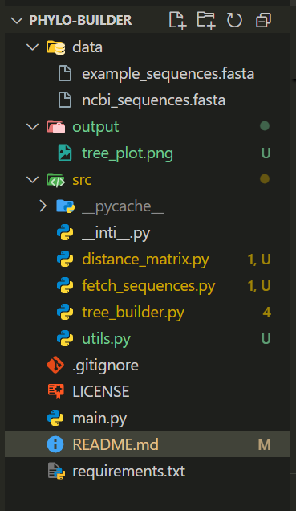

# phylo-builder

A Python tool to generate phylogenetic trees from DNA sequences using pairwise distance and UPGMA clustering. This project demonstrates core bioinformatics workflows like sequence comparison, distance matrix generation, and evolutionary modeling.

## Features

- Fetch DNA sequences directly from NCBI GenBank using accession IDs
- Parse and process sequences from FASTA format
- Compute pairwise genetic distances using Hamming distance
- Build a phylogenetic tree using UPGMA clustering
- Visualize and save the resulting tree

## Example Use Case

This tool compares multiple strains of *Mycobacterium bovis* based on 16S and 23S ribosomal RNA gene sequences, then visualizes their genetic relationships using a phylogenetic tree.

Example output is saved to:  

output/tree_plot.png

## How to Run

### 1. Install dependencies

```bash
pip install -r requirements.txt
```

```bash
python main.py
```

This will:

Fetch real bacterial gene sequences from NCBI

Compute their pairwise distances

Generate and save a phylogenetic tree

## Configuration
To change which sequences are fetched, modify the list of GenBank accession IDs in main.py:

```bash
genbank_ids = [
    "L26328.1",
    "L26327.1",
    "AY360331.1",
    "JX473574.1"
]
```
You can search for new IDs at: https://www.ncbi.nlm.nih.gov/nuccore/



## Tech Stack
Python 3

Biopython

SciPy

Matplotlib

Author
Sarab Aulakh